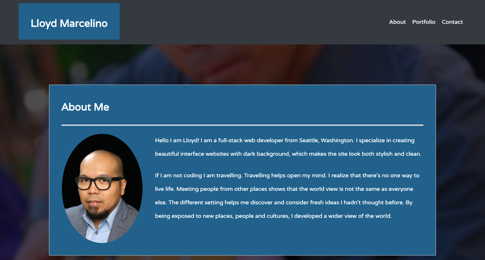
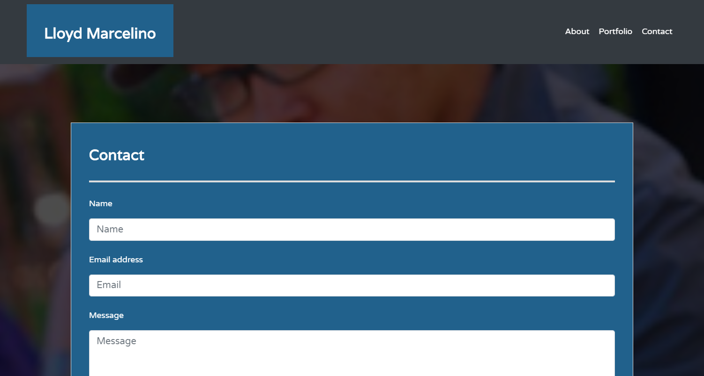

# Portfolio
Unit 02 CSS and Bootstrap Homework: Responsive Portfolio

# Installation

No installation required. 

# Usage

Responsive web applications that render well on a variety of devices and window or screen sizes. 
This portfolio design implemented the following:

1. Modified HW1
2. Used CSS Typography to create font style and font sizes.
3. Google Font (link) to achieve stunning font.
4. Pseduo-class on links and buttons
5. BootStrap's Text layout and grid system (containers, rows and columns) 
6. BootStrap to create a navbar, responsive layout and responsive images.
7. BootStrap to minimize the use of CSS and media queries.
8. BootStrap to create a sticky footer and use sub-row/ sub-columns.

## index.hmtl 
Information and photo image 
-Write a paragraph or two about yourself.

## portfolio.html 
contains your personal projects, group projects, github projects. etc.

## contact.html 
how user can contact you.

# License

Copyright. All rights reserved

Licensed under the [MIT](LICENSE.txt) License.
